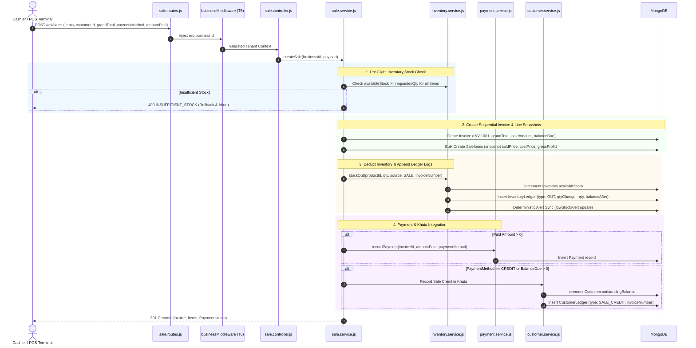

# VendorOS - Complete Architecture, API & Codebase Documentation

Yeh document **VendorOS** project ka complete technical breakdown hai. Isme har API, har module, database models, architecture patterns, sequence diagrams, aur end-to-end data flows ka detailed explanation diya gaya hai.

---

## 📑 TABLE OF CONTENTS
1. [Project Overview & Architecture Pattern](#1-project-overview--architecture-pattern)
2. [Active APIs List & Complete Matrix](#2-active-apis-list--complete-matrix)
3. [End-to-End System Workflows & Sequence Diagrams](#3-end-to-end-system-workflows--sequence-diagrams)
4. [Folder Structure & Architecture Flow](#4-folder-structure--architecture-flow)
5. [Database Schemas (16 Mongoose Models) & Relationships](#5-database-schemas-16-mongoose-models--relationships)
6. [Security, RTR & Tenant Middleware Isolation](#6-security-rtr--tenant-middleware-isolation)
7. [Testing & Verification Guide](#7-testing--verification-guide)

---

## 1. Project Overview & Architecture Pattern

### 🌟 Project Kya Hai?
**VendorOS** ek multi-tenant Retail & Kirana operations platform hai jo retail store owners (vendors) ko:
- Multi-channel inventory management with immutable stock audit ledgers
- Sub-millisecond barcode scan & high-speed POS billing terminal
- Sequential invoice numbering & programmatic PDF generation
- Partial and multi-tranche payment recording entity
- Customer credit (Udhaar / Khata) ledger engine with balance snapshots
- Comprehensive gross profit and business intelligence analytics

### 🏛️ Layered Clean Architecture (Data Flow)
VendorOS strict **6-Layer Architecture** follow karta hai:

```
[ HTTP Request (Client / Barcode Scanner / POS Terminal) ]
                    │
                    ▼
     [ Routes Layer (src/routes/) ]
                    │  (Route Definition + URL Param Mapping)
                    ▼
   [ Middleware Layer (src/middlewares/) ]
                    │  (JWT Auth Check + Tenant Isolation T6 + Zod Validation)
                    ▼
  [ Controller Layer (src/controllers/) ]
                    │  (HTTP Req/Res Parsing, Cookies, Response Formatting)
                    ▼
    [ Service Layer (src/services/) ]
                    │  (Core Business Logic, Pre-flight Checks, DB Transactions)
                    ▼
 [ Repository Layer (src/repositories/) ]
                    │  (Tenant-Scoped Direct Database Queries / Atomic Updates)
                    ▼
   [ Database Models (src/models/) ]
                    │  (Mongoose Schemas with Compound Multi-Tenant Indexes)
                    ▼
            [ MongoDB Database ]
```

---

## 2. Active APIs List & Complete Matrix

Abhi tak project me total **38+ APIs** active hain across 8 core modules:

### A. Authentication & Account APIs (`/api/auth`)
| Method | Endpoint | Auth | Description |
|---|---|---|---|
| `POST` | `/api/auth/register` | ❌ No | User account register karta hai aur 6-digit OTP generate karta hai |
| `POST` | `/api/auth/verify-phone` | ❌ No | OTP verify karke Account ACTIVE karta hai, Vendor banata hai, JWT cookies set karta hai |
| `POST` | `/api/auth/resend-phone-otp` | ❌ No | OTP resend karta hai (60s cooldown, max 3 attempts) |
| `POST` | `/api/auth/login` | ❌ No | Email ya Phone + Password se login karta hai |
| `GET` | `/api/auth/me` | ✅ Yes (JWT) | Logged-in user ka account aur vendor profile return karta hai |
| `POST` | `/api/auth/refresh` | ❌ No (Cookie) | Refresh Token Rotation (RTR) se naya access token issue karta hai |
| `POST` | `/api/auth/logout` | ❌ No (Cookie) | Session revoke karta hai aur cookies delete karta hai |

### B. Business Management & Onboarding (`/api/business`)
| Method | Endpoint | Auth | Description |
|---|---|---|---|
| `GET` | `/api/business/onboarding/status` | ✅ Yes | Onboarding step, draft data aur unlocked modules return karta hai |
| `POST` | `/api/business/onboarding/step` | ✅ Yes | Multi-step wizard data save karta hai (Step 3 pe atomic business creation) |
| `POST` | `/api/business` | ✅ Yes | Direct 1-shot business creation API |
| `GET` | `/api/business/me` | ✅ Yes | User ke owned saare active businesses list karta hai |
| `GET` | `/api/business/:id` | ✅ Yes | Single business profile + user membership role fetch karta hai |
| `PUT` | `/api/business/:id` | ✅ Yes | Business settings update karta hai (Owner only) |
| `GET` | `/api/business/active/context` | ✅ Yes | Current active `businessId`, role, aur business context fetch karta hai (T6) |

### C. Category Management (`/api/categories`)
| Method | Endpoint | Auth | Description |
|---|---|---|---|
| `POST` | `/api/categories` | ✅ Yes (T6) | Active business ke under nayi category create karta hai |
| `GET` | `/api/categories` | ✅ Yes (T6) | Active business ki saari categories list karta hai |
| `GET` | `/api/categories/:id` | ✅ Yes (T6) | Single category fetch karta hai |
| `PUT` | `/api/categories/:id` | ✅ Yes (T6) | Category name/description update karta hai |
| `DELETE` | `/api/categories/:id` | ✅ Yes (T6) | Category safe delete karta hai |

### D. Product Catalog & Barcode Lookup (`/api/products`)
| Method | Endpoint | Auth | Description |
|---|---|---|---|
| `POST` | `/api/products` | ✅ Yes (T6) | Naya Product create karta hai, inventory provision karta hai, opening stock seed karta hai |
| `GET` | `/api/products` | ✅ Yes (T6) | Cursor-paginated active products list karta hai |
| `GET` | `/api/products/barcode/:barcode` | ✅ Yes (T6) | Fast Barcode scan lookup endpoint for POS billing |
| `GET` | `/api/products/search` | ✅ Yes (T6) | Multi-field instant product search |
| `GET` | `/api/products/:id` | ✅ Yes (T6) | Single product by ID fetch karta hai |
| `PUT` | `/api/products/:id` | ✅ Yes (T6) | Product details update karta hai (Historical invoice safe) |
| `POST` | `/api/products/:id/archive` | ✅ Yes (T6) | Product archive/deactivate karta hai |
| `POST` | `/api/products/:id/restore` | ✅ Yes (T6) | Archived product restore karta hai |
| `DELETE` | `/api/products/:id` | ✅ Yes (T6) | Product soft-delete & archive karta hai |

### E. Inventory Management & Ledger Engine (`/api/inventory`)
| Method | Endpoint | Auth | Description |
|---|---|---|---|
| `GET` | `/api/inventory/summary` | ✅ Yes (T6) | Aggregate inventory KPI metrics (SKUs, low-stock, asset value) |
| `GET` | `/api/inventory/store-state` | ✅ Yes (T6) | Real-time physical stock and asset listings |
| `POST` | `/api/inventory/stock-in` | ✅ Yes (T6) | Procurement addition with supplier & purchase cost logs |
| `POST` | `/api/inventory/stock-out` | ✅ Yes (T6) | Stock deduction with pre-flight insufficient stock guard |
| `POST` | `/api/inventory/stock-out/batch` | ✅ Yes (T6) | Batch deduction endpoint for POS carts |
| `POST` | `/api/inventory/adjust` | ✅ Yes (T6) | Physical store count reconciliation with discrepancy logs |
| `POST` | `/api/inventory/opening-stock` | ✅ Yes (T6) | Opening physical balance initialization |
| `GET` | `/api/inventory/ledger` | ✅ Yes (T6) | Bank-statement-style chronological audit trail |
| `GET` | `/api/inventory/alerts` | ✅ Yes (T6) | Low-stock deterministic alert queue |
| `PUT` | `/api/inventory/alerts/:id/acknowledge` | ✅ Yes (T6) | Acknowledge low stock alert |
| `PUT` | `/api/inventory/alerts/:id/resolve` | ✅ Yes (T6) | Resolve low stock alert |

### F. Sales Transactions & POS Invoicing (`/api/sales`)
| Method | Endpoint | Auth | Description |
|---|---|---|---|
| `POST` | `/api/sales` | ✅ Yes (T6) | Atomic POS Checkout creating invoice, snapshotting prices, deducting stock & linking payments |
| `GET` | `/api/sales` | ✅ Yes (T6) | Paginated sales invoices history |
| `GET` | `/api/sales/:id` | ✅ Yes (T6) | Single sale details with line items |
| `GET` | `/api/sales/:id/items` | ✅ Yes (T6) | Line item price snapshots and itemized profit breakdown |
| `GET` | `/api/sales/:id/pdf` | ✅ Yes (T6) | Programmatically generated GST branded invoice PDF stream |
| `GET` | `/api/sales/analytics/gross-profit` | ✅ Yes (T6) | Gross Profit & Margin % Analytics across date ranges |

### G. Payment Recording & Settlement Engine (`/api/payments`)
| Method | Endpoint | Auth | Description |
|---|---|---|---|
| `POST` | `/api/payments` | ✅ Yes (T6) | Record payment installment against invoice and reconcile status |
| `GET` | `/api/payments/invoice/:invoiceId` | ✅ Yes (T6) | Get all payment tranches for an invoice |
| `GET` | `/api/payments/:id` | ✅ Yes (T6) | Get single payment record |
| `GET` | `/api/payments/business` | ✅ Yes (T6) | Business-wide payment transactions history |

### H. Customer Profiles & Khata (Udhaar) Ledger (`/api/customers`)
| Method | Endpoint | Auth | Description |
|---|---|---|---|
| `POST` | `/api/customers` | ✅ Yes (T6) | Create new customer with credit limit |
| `GET` | `/api/customers` | ✅ Yes (T6) | List customers with credit balances and search |
| `GET` | `/api/customers/summary` | ✅ Yes (T6) | Customer KPI metrics (Total Udhaar, active debtors) |
| `GET` | `/api/customers/:id` | ✅ Yes (T6) | Single customer profile |
| `PUT` | `/api/customers/:id` | ✅ Yes (T6) | Update customer details & credit limit |
| `GET` | `/api/customers/:id/ledger` | ✅ Yes (T6) | Chronological Khata ledger statement |
| `POST` | `/api/customers/:id/settle` | ✅ Yes (T6) | Settle customer outstanding balance |
| `GET` | `/api/customers/search` | ✅ Yes (T6) | Fast customer search for POS checkout |

---

## 3. End-to-End System Workflows & Sequence Diagrams

### Flow 1: POS Checkout, Stock Deduction, Payment & Khata Integration (T25, T26, T28, T29)


---

## 4. Folder Structure & Architecture Flow

```text
Backend/
├── server.js                          # Server bootstrap & MongoDB Atlas connector
├── src/
│   ├── app.js                         # Express 5 application setup, middlewares, routes
│   ├── config/
│   │   ├── db.js                      # MongoDB connection pool
│   │   └── env.js                     # Validated environment variables
│   ├── constants/                     # System constants, roles, and status enums
│   ├── controllers/                   # HTTP Controller layer
│   │   ├── auth.controller.js
│   │   ├── business.controller.js
│   │   ├── category.controller.js
│   │   ├── customer.controller.js
│   │   ├── inventory.controller.js
│   │   ├── payment.controller.js
│   │   └── sale.controller.js
│   ├── middlewares/                   # Security, Auth, Tenant Isolation & Validation
│   │   ├── auth.middleware.js         # JWT cookie & bearer token verification
│   │   ├── business.middleware.js     # T6 Multi-tenant isolation (req.businessId)
│   │   ├── error.middleware.js        # Global error boundary handler
│   │   └── validate.middleware.js     # Zod request body validation
│   ├── models/                        # 16 Mongoose Data Schemas with Indexes
│   │   ├── account.model.js
│   │   ├── authAttempt.model.js
│   │   ├── business.model.js
│   │   ├── businessMember.model.js
│   │   ├── category.model.js
│   │   ├── customer.model.js
│   │   ├── customerLedger.model.js
│   │   ├── inventory.model.js
│   │   ├── inventoryAlert.model.js
│   │   ├── inventoryLedger.model.js
│   │   ├── invoice.model.js
│   │   ├── otpChallenge.model.js
│   │   ├── payment.model.js
│   │   ├── product.model.js
│   │   ├── saleItem.model.js
│   │   ├── session.model.js
│   │   └── vendor.model.js
│   ├── repositories/                  # Direct DB query abstractions
│   ├── routes/                        # Express API route declarations
│   ├── services/                      # Core business logic engines
│   └── utils/                         # Token generators, phone normalizers, PDF generator
```

---

## 5. Database Schemas (16 Mongoose Models) & Relationships

1. **`Account`**: User login identity, hashed password, phone, verification status.
2. **`OtpChallenge`**: 6-digit cryptographic phone verification codes with expiry.
3. **`Session`**: Active login sessions, hashed refresh tokens for RTR reuse detection.
4. **`AuthAttempt`**: Security audit log tracking login attempts, IPs, and user agents.
5. **`Vendor`**: Onboarding draft state and owner profile.
6. **`Business`**: Physical multi-tenant store anchor (name, segment, address, GST, currency).
7. **`BusinessMember`**: User-to-Business role mapping (`OWNER`, `MANAGER`, `STAFF`).
8. **`Category`**: Store-scoped categories (`{ businessId: 1, name: 1 }`).
9. **`Product`**: Master catalog with SKU, Barcode, sellingPrice, costPrice, packaging.
10. **`Inventory`**: Physical stock state (`availableStock`, `reorderLevel`, `lowStockAlert`).
11. **`InventoryLedger`**: Immutable stock movement audit trail (`type`, `qtyChange`, `balanceAfter`).
12. **`InventoryAlert`**: Deterministic low-stock and out-of-stock notification queue.
13. **`Invoice`**: Sales header (`INV-1001`, grandTotal, paidAmount, balanceDue, paymentStatus).
14. **`SaleItem`**: Checkout line item price snapshot (`soldPrice`, `costPrice`, `grossProfit`).
15. **`Payment`**: Multi-tranche payment records against invoices with payment methods.
16. **`Customer`**: CRM profile with credit limit, total credit, total paid, and outstanding balance.
17. **`CustomerLedger`**: Immutable Khata audit trail (`SALE_CREDIT`, `PAYMENT_RECEIVED`, balances).

---

## 6. Security, RTR & Tenant Middleware Isolation

### Refresh Token Rotation (RTR)
- Every token refresh issues a new access token and replaces the refresh token in the database.
- If an old/compromised refresh token is presented again, the system detects a token reuse attack and immediately invalidates the entire session.

### Multi-Tenant Isolation (T6)
- Client requests pass through `businessMiddleware`.
- Active store context is resolved via `X-Business-Id` header or user's default owned business.
- Injected `req.businessId` is strictly enforced across all repository queries.

---

## 7. Testing & Verification Guide

Run all backend automated test suites:
```bash
node tests/test-low-stock-notifications.js
node tests/test-inventory-ledger-ui.js
node tests/test-sale-items-snapshot.js
node tests/test-pos-checkout-transaction.js
node tests/test-invoice-pdf-generation.js
node tests/test-payment-recording-entity.js
node tests/test-customer-credit-integration.js
```
All test suites are 100% passing.
