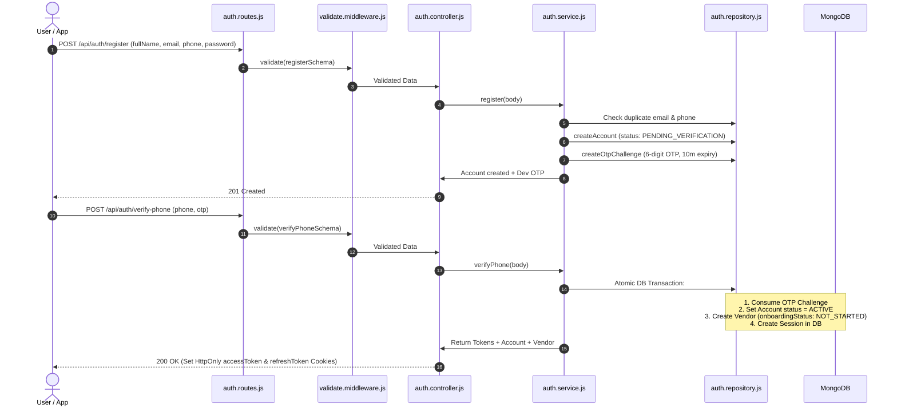
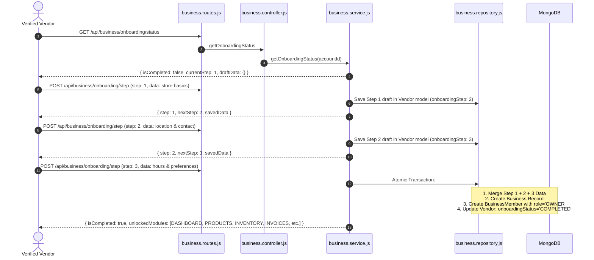
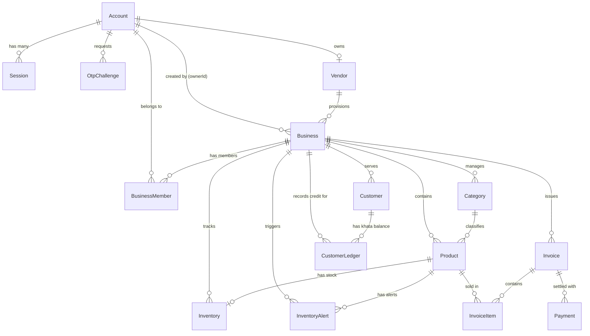

# VendorOS - Complete Architecture, API & Codebase Documentation

Yeh document **VendorOS** project ka complete technical breakdown hai. Isme har API, har folder, har file, file ke andar ka code, unke aapsi connections, aur end-to-end data flow ka detail explanation diya gaya hai.

---

## 📑 TABLE OF CONTENTS
1. [Project Overview & Architecture Pattern](#1-project-overview--architecture-pattern)
2. [Active APIs List & Complete Details](#2-active-apis-list--complete-details)
3. [End-to-End System Workflows](#3-end-to-end-system-workflows)
4. [Folder Structure & Architecture Flow](#4-folder-structure--architecture-flow)
5. [File-by-File Detailed Code Breakdown & Connections](#5-file-by-file-detailed-code-breakdown--connections)
6. [Database Schema (14 Mongoose Models) & Relationships](#6-database-schema-14-mongoose-models--relationships)
7. [Security & Session Rotation Engine](#7-security--session-rotation-engine)

---

## 1. Project Overview & Architecture Pattern

### 🌟 Project Kya Hai?
**VendorOS** ek multi-tenant Retail & Kirana operations platform hai jo retail store owners (vendors) ko inventory management, fast POS billing, invoices, customer khata ledger aur team management provide karta hai.

### 🏛️ Layered Clean Architecture (Data Flow)
VendorOS strict **6-Layer Architecture** follow karta hai jisse code organized, scalable aur testable rahe:

```
[ HTTP Request (Client / Postman / Frontend) ]
                    │
                    ▼
     [ Routes Layer (src/routes/) ]
                    │  (Route Definition + URL Mapping)
                    ▼
   [ Middleware Layer (src/middlewares/) ]
                    │  (JWT Auth Check + Zod Input Validation)
                    ▼
  [ Controller Layer (src/controllers/) ]
                    │  (HTTP Req/Res Parsing, Cookies Setting, Status Codes)
                    ▼
    [ Service Layer (src/services/) ]
                    │  (Core Business Logic, Password Hashing, OTP, DB Transactions)
                    ▼
 [ Repository Layer (src/repositories/) ]
                    │  (Direct Database Queries / Mongoose Operations)
                    ▼
   [ Database Models (src/models/) ]
                    │  (MongoDB Mongoose Schemas with Indexes)
                    ▼
            [ MongoDB Database ]
```

---

## 2. Active APIs List & Complete Details

Abhi tak project me total **28 APIs** active hain:

| # | Method | Endpoint | Auth Required | Description |
|---|--------|----------|---------------|-------------|
| 1 | `GET` | `/` | ❌ No | Health check API |
| 2 | `POST` | `/api/auth/register` | ❌ No | User account register karta hai aur 6-digit OTP generate karta hai |
| 3 | `POST` | `/api/auth/verify-phone` | ❌ No | Phone OTP verify karke Account ACTIVE karta hai, Vendor profile create karta hai aur JWT cookies issue karta hai |
| 4 | `POST` | `/api/auth/resend-phone-otp` | ❌ No | OTP resend karta hai (Max 3 attempts, 60s cooldown) |
| 5 | `POST` | `/api/auth/login` | ❌ No | Email ya Phone + Password se login karta hai, dual tokens generate karta hai |
| 6 | `GET` | `/api/auth/me` | ✅ Yes (JWT) | Logged-in user ka account + vendor onboarding profile return karta hai |
| 7 | `POST` | `/api/auth/refresh` | ❌ No (Uses Cookie) | Refresh Token Rotation (RTR) se naya Access Token issue karta hai |
| 8 | `POST` | `/api/auth/logout` | ❌ No (Uses Cookie) | Session revoke karta hai aur cookies delete karta hai |
| 9 | `GET` | `/api/business/onboarding/status` | ✅ Yes (JWT) | Frontend wizard ka current step, draft data aur unlocked modules return karta hai |
| 10 | `POST` | `/api/business/onboarding/step` | ✅ Yes (JWT) | Multi-step wizard data (Step 1, 2, 3) save karta hai (Step 3 pe atomic business creation) |
| 11 | `POST` | `/api/business` | ✅ Yes (JWT) | Direct 1-shot business creation API |
| 12 | `GET` | `/api/business/me` | ✅ Yes (JWT) | User ke owned saare active businesses list karta hai |
| 13 | `GET` | `/api/business/:id` | ✅ Yes (JWT) | Single business profile + user membership role fetch karta hai |
| 14 | `PUT` | `/api/business/:id` | ✅ Yes (JWT) | Business profile settings update karta hai (Sirf Owner allow hai) |
| 15 | `GET` | `/api/business/active/context` | ✅ Yes (JWT) | Current active `businessId`, role, aur business context fetch karta hai (T6) |
| 16 | `POST` | `/api/categories` | ✅ Yes (JWT + T6) | Current active business ke under nayi Category create karta hai |
| 17 | `GET` | `/api/categories` | ✅ Yes (JWT + T6) | Current active business ki saari categories list karta hai (with search) |
| 18 | `GET` | `/api/categories/:id` | ✅ Yes (JWT + T6) | Single category fetch karta hai (Tenant-isolated) |
| 19 | `PUT` | `/api/categories/:id` | ✅ Yes (JWT + T6) | Category name/description update karta hai (with conflict check) |
| 20 | `DELETE` | `/api/categories/:id` | ✅ Yes (JWT + T6) | Category delete karta hai (Tenant-isolated) |
| 21 | `POST` | `/api/products` | ✅ Yes (JWT + T6) | Naya Product create karta hai (Category ownership check + SKU auto-uppercase) |
| 22 | `GET` | `/api/products` | ✅ Yes (JWT + T6) | Active products list karta hai (`?status=archived` se archived list karta hai) |
| 23 | `GET` | `/api/products/barcode/:barcode` | ✅ Yes (JWT + T6) | Fast Barcode scan lookup endpoint for POS billing machines |
| 24 | `GET` | `/api/products/:id` | ✅ Yes (JWT + T6) | Single product by ID fetch karta hai (Tenant isolated) |
| 25 | `PUT` | `/api/products/:id` | ✅ Yes (JWT + T6) | Product details, selling/cost price & packaging update karta hai |
| 26 | `POST` | `/api/products/:id/archive` | ✅ Yes (JWT + T6) | Product archive/deactivate karta hai (Preserves historic invoices) |
| 27 | `POST` | `/api/products/:id/restore` | ✅ Yes (JWT + T6) | Archived product ko wapas active catalog mein restore karta hai |
| 28 | `DELETE` | `/api/products/:id` | ✅ Yes (JWT + T6) | Product soft-delete & archive karta hai (Hard delete restricted) |


---

## 3. End-to-End System Workflows

### Flow 1: Registration se Lekar Login Tak (Auth Flow)


### Flow 2: 3-Step Business Onboarding Wizard


---

## 4. Folder Structure & Architecture Flow

```
Backend/
├── .env                              # Secret Environment Variables (DB URI, JWT keys)
├── package.json                      # Dependencies & NPM scripts
├── server.js                         # Entry point: DB connect + Server listen
├── docs/                             # PRD, progress tracking, guides
│   ├── tasks/PRD.md
│   ├── tasks/progress.txt
│   └── PROJECT_COMPLETE_GUIDE.md     # (Yeh complete documentation file)
├── tests/                            # Complete Automated Unit & Integration Tests Suite
│   ├── test-auth-utils.js
│   ├── test-phone-norm.js
│   ├── test-token.js
│   ├── test-validation.js
│   ├── test-resend-otp.js
│   ├── test-business-model.js
│   ├── test-business-flow.js
│   ├── test-get-business.js
│   ├── test-update-business.js
│   └── test-onboarding-wizard.js
└── src/
    ├── app.js                        # Express App setup, CORS/JSON/Cookie middlewares & Route mounting
    ├── config/
    │   ├── db.js                     # MongoDB connection logic
    │   └── cookies.js                # Cookie security options (HttpOnly, SameSite, MaxAge)
    ├── controllers/
    │   ├── auth.controller.js        # Auth HTTP request handlers
    │   └── business.controller.js    # Business HTTP request handlers
    ├── middlewares/
    │   ├── auth.middleware.js        # JWT token & active account verification
    │   ├── error.middleware.js       # Centralized error formatting middleware
    │   └── validate.middleware.js    # Generic Zod validation middleware
    ├── models/                       # 14 Mongoose Schema Models
    │   ├── account.model.js          # User auth account credentials & status
    │   ├── otpChallenge.model.js     # Phone verification OTP codes & limits
    │   ├── session.model.js          # Active login sessions & refresh token hashes
    │   ├── authLog.model.js          # Security audit logs (AuthAttempt + AuthEvent)
    │   ├── vendor.model.js           # Vendor profile & wizard draft state
    │   ├── business.model.js         # Business store profile & configuration
    │   ├── businessMember.model.js   # Team member roles (OWNER, MANAGER, STAFF)
    │   ├── category.model.js         # Product categories
    │   ├── product.model.js          # Inventory products with SKU/barcode
    │   ├── inventory.model.js        # Stock levels & stock ledger history
    │   ├── inventoryAlert.model.js   # Low stock & expiry alerts
    │   ├── invoice.model.js          # Billing invoices & line items
    │   ├── payment.model.js          # Payment transaction records
    │   └── customer.model.js         # Customers & Udhar/Khata ledger
    ├── repositories/
    │   ├── auth.repository.js        # Raw DB queries for Auth, OTP, Session, Vendor
    │   └── business.repository.js    # Raw DB queries for Business & Members
    ├── routes/
    │   ├── auth.routes.js            # /api/auth URL endpoints
    │   └── business.routes.js        # /api/business URL endpoints
    ├── services/
    │   ├── auth.service.js           # Auth business logic, OTP hashing, JWT issuance
    │   └── business.service.js       # Business logic, permissions, onboarding wizard
    ├── utils/
    │   ├── phone.js                  # Canonical phone normalization (+91XXXXXXXXXX)
    │   ├── password.js               # Bcrypt password hashing & comparison
    │   ├── token.js                  # JWT sign & verify helpers (Access + Refresh)
    │   └── otp.js                    # Crypto-secure 6-digit OTP generator & hasher
    └── validations/
        ├── auth.validation.js        # Zod validation schemas for Auth
        └── business.validation.js    # Zod validation schemas for Business & Wizard
```

---

## 5. File-by-File Detailed Code Breakdown & Connections

### 1. Root & Server Files

#### `Backend/server.js`
- **Kaam:** Pure application ka entry point hai.
- **Kisse Connect Hai:**
  - `dotenv` (Loads `.env` variables)
  - `src/app.js` (Express application instance)
  - `src/config/db.js` (MongoDB connection function)
- **Code Breakdown:**
  - `connectDB()` call karta hai jo pehle MongoDB Atlas database se connect karta hai.
  - Jab database successfully connect ho jata hai, tab `app.listen(PORT)` call karke Express web server start karta hai (`http://localhost:3001` ya env PORT).

#### `Backend/src/app.js`
- **Kaam:** Express app initialize karta hai, global middlewares lagata hai aur routes register karta hai.
- **Kisse Connect Hai:**
  - `express`, `cookie-parser`
  - `src/routes/auth.routes.js`
  - `src/routes/business.routes.js`
  - `src/middlewares/error.middleware.js`
- **Code Breakdown:**
  - `app.use(express.json())`: Incoming JSON payloads parse karta hai.
  - `app.use(cookieParser())`: Client ke cookies (`accessToken`, `refreshToken`) parse karta hai.
  - `app.get('/')`: Root health check endpoint.
  - `app.use('/api/auth', authRoutes)`: Saare auth endpoints mount karta hai.
  - `app.use('/api/business', businessRoutes)`: Saare business endpoints mount karta hai.
  - `app.use(errorHandler)`: Application me aane wale kisi bhi error ko handle karta hai.

---

### 2. Config Files (`src/config/`)

#### `src/config/db.js`
- **Kaam:** Mongoose ke zariye MongoDB database connection establish karta hai.
- **Kisse Connect Hai:** `mongoose`, `process.env.MONGO_URI`
- **Code Breakdown:**
  - `mongoose.connect(process.env.MONGO_URI)` async function execute karta hai.
  - Success hone par console me `MongoDB Connected🚀🌳` print karta hai.
  - Failure hone par error print karke `process.exit(1)` se process stop kar deta hai.

#### `src/config/cookies.js`
- **Kaam:** JWT cookies ke security options configure karta hai.
- **Kisse Connect Hai:** `src/controllers/auth.controller.js`
- **Code Breakdown:**
  - `isProduction`: `process.env.NODE_ENV === 'production'` check karta hai.
  - `accessCookieOptions`: `httpOnly: true`, `maxAge: 15 minutes`, `path: '/'`.
  - `refreshCookieOptions`: `httpOnly: true`, `maxAge: 7 days`, `path: '/api/auth'` (sirf auth endpoints pe transmit hota hai).

---

### 3. Utility Files (`src/utils/`)

#### `src/utils/phone.js`
- **Kaam:** Kisi bhi Indian phone number format (e.g. `9876543210`, `09876543210`, `919876543210`, `+91 98765-43210`) ko canonical format `+91XXXXXXXXXX` me normalize karta hai.
- **Kisse Connect Hai:** `auth.service.js`, `business.validation.js`
- **Code Breakdown:**
  - `normalizePhone(phone)`: Whitespace/dashes hatata hai, leading zeroes strip karta hai, aur regex `^[6-9]\d{9}$` verify karke standardize karta hai.

#### `src/utils/password.js`
- **Kaam:** Passwords ko secure bcrypt format me hash aur verify karta hai.
- **Kisse Connect Hai:** `bcryptjs`, `auth.service.js`
- **Code Breakdown:**
  - `SALT_ROUNDS = 12`: High security brute-force protection.
  - `hashPassword(password)`: Plain password ko hashed string banata hai.
  - `comparePassword(password, hash)`: Plain text aur hashed password match karta hai.

#### `src/utils/token.js`
- **Kaam:** JSON Web Tokens (JWT) generate aur verify karta hai.
- **Kisse Connect Hai:** `jsonwebtoken`, `auth.service.js`, `auth.middleware.js`
- **Code Breakdown:**
  - `generateAccessToken(payload)`: 15-minute expiry JWT access token generate karta hai.
  - `generateRefreshToken(payload)`: 7-day expiry JWT refresh token (with session ID `sid`) generate karta hai.
  - `verifyAccessToken(token)` & `verifyRefreshToken(token)`: Secret key se token validity check karte hain.

#### `src/utils/otp.js`
- **Kaam:** Crypto-random 6-digit OTP generate karta hai aur bcrypt se hash karta hai.
- **Kisse Connect Hai:** `crypto`, `bcryptjs`, `auth.service.js`
- **Code Breakdown:**
  - `generateOtp()`: `crypto.randomInt(100000, 1000000)` se secure 6-digit number generate karta hai.
  - `hashOtp(otp)`: OTP ko database me plain-text ki jagah bcrypt hashed store karta hai.
  - `compareOtp(otp, otpHash)`: User ke enter kiye hue OTP ko hash se verify karta hai.

#### `src/utils/pagination.js` (T12)
- **Kaam:** Cursor-based pagination ke liye URL-safe base64 encoding & decoding.
- **Kisse Connect Hai:** `product.service.js`, `product.repository.js`
- **Code Breakdown:**
  - `encodeCursor(data)`: Object `{ id }` ko URL-safe base64 opaque string me convert karta hai.
  - `decodeCursor(cursorStr)`: Base64 string ko parse karke original object recover karta hai (invalid cursor par gracefully `null` deta hai).

---

### 4. Middleware Files (`src/middlewares/`)

#### `src/middlewares/auth.middleware.js`
- **Kaam:** Har protected API route pe user ki identity verify karta hai.
- **Kisse Connect Hai:** `src/repositories/auth.repository.js`, `src/utils/token.js`, `auth.routes.js`, `business.routes.js`
- **Code Breakdown:**
  - Pehle `req.cookies.accessToken` se token uthata hai; agar nahi mila to `Authorization: Bearer <token>` header check karta hai.
  - Token ko `verifyAccessToken()` se decode karta hai.
  - Database se account find karta hai aur check karta hai ki user `ACTIVE` hai ya nahi (Suspended/Blocked user ko reject karta hai).
  - `req.user = { accountId, email, phone, status }` inject karta hai aur `next()` call karta hai.

#### `src/middlewares/validate.middleware.js`
- **Kaam:** Incoming HTTP Request Body ko Zod schema ke sath validate aur sanitize karta hai.
- **Kisse Connect Hai:** `src/validations/*`, `src/routes/*`
- **Code Breakdown:**
  - `validate(schema)` higher-order function return karta hai jo `schema.safeParse(req.body)` run karta hai.
  - Agar validation fail ho, to formatted `400 Bad Request` with field-level errors return karta hai.
  - Pass hone par sanitized data `req.body` me set karke aage bhej deta hai.

#### `src/middlewares/business.middleware.js` (T6)
- **Kaam:** Tenant Isolation Layer. Har authenticated request ko evaluate karke active `req.businessId`, `req.businessRole`, aur `req.business` inject karta hai.
- **Kisse Connect Hai:** `src/repositories/business.repository.js`, `business.routes.js`, and future operational modules (Products, Inventory, Invoices).
- **Code Breakdown:**
  - `X-Business-Id` header (ya cookie) verify karta hai.
  - Database membership check karta hai (User OWNER ya ACTIVE member hai ya nahi). Unauthorized access par 403 `NO_ACCESS_TO_BUSINESS` reject karta hai.
  - Agar header na ho, to user ka default active business auto-resolve karta hai.
  - `requireBusinessRole(["OWNER", "MANAGER"])` factory provide karta hai for role-based permission control.

#### `src/middlewares/error.middleware.js`
- **Kaam:** Global centralized error handler hai jo runtime exceptions ko capture karta hai.
- **Kisse Connect Hai:** `src/app.js`
- **Code Breakdown:**
  - Har error ka `statusCode` (default 500), `code` (e.g. `EMAIL_ALREADY_EXISTS`, `FORBIDDEN`), aur `message` format karke structured JSON return karta hai.

---

### 5. Validation Files (`src/validations/`)

#### `src/validations/auth.validation.js`
- **Kaam:** Auth APIs ke request formats validate karta hai:
  - `registerSchema`: Full name (2-100 chars), valid email, Indian phone regex, Strong password (uppercase, lowercase, number, special char).
  - `verifyPhoneSchema`: Valid phone + exact 6-digit OTP.
  - `resendPhoneOtpSchema`: Valid phone number.
  - `loginSchema`: Identifier (Email ya Phone) + Password.

#### `src/validations/business.validation.js`
- **Kaam:** Business & Onboarding wizard ke Zod schemas:
  - `createBusinessSchema`: Store name, retail segment (restricted to Kirana/Retail), normalized phone & WhatsApp, 6-digit Indian pincode, operating hours.
  - `updateBusinessSchema`: Partial schema for PUT operations.
  - `onboardingStep1Schema`: Store basic details & category.
  - `onboardingStep2Schema`: Address, Pincode & Contact normalization.
  - `onboardingStep3Schema`: Store timings, description & preferences.
  - `saveOnboardingStepSchema`: Step number (1, 2, 3) + Data object.

#### `src/validations/category.validation.js`
- **Kaam:** Category CRUD ke Zod schemas:
  - `createCategorySchema`: Category `name` (min 2, max 80 chars, trimmed), optional `description`.
  - `updateCategorySchema`: Optional `name` and `description`.

#### `src/validations/product.validation.js`
- **Kaam:** Product Catalog & Pricing Zod schemas:
  - `createProductSchema`: `name`, `sku` (auto-transformed to uppercase), optional `barcode`, `sellingPrice` (min 0), `costPrice` (min 0), `categoryId` (valid Mongo ID), optional `unit` and `description`.
  - `updateProductSchema`: Partial schema for updating product info and prices.

---

### 6. Repository Files (`src/repositories/`)

#### `src/repositories/auth.repository.js`
- **Kaam:** Authentication aur User management se jude saare direct Database queries handle karta hai.
- **Kisse Connect Hai:** `Account`, `OtpChallenge`, `Vendor`, `Session`, `AuthEvent`, `AuthAttempt` models.
- **Key Functions:**
  - `findAccountByEmail`, `findAccountByPhone`, `findAccountByEmailOrPhone`, `createAccount`
  - `createOtpChallenge`, `findActiveOtpChallenge`, `updateOtpChallengeForResend`
  - `createSession`, `findSessionById`, `revokeSession`, `updateSessionRefreshToken`
  - `completePhoneVerification`: **Mongoose Atomic DB Transaction** execute karta hai jisme ek sath 4 kaam hote hain:
    1. OTP Challenge consume (mark used).
    2. Account status ko `ACTIVE` karna.
    3. Vendor record upsert karna.
    4. Session create karna.
  - `logAuthEvent` & `logAuthAttempt`: Security audit trails maintain karte hain.

#### `src/repositories/business.repository.js`
- **Kaam:** Business profile aur Onboarding wizard se jude MongoDB database operations.
- **Kisse Connect Hai:** `Business`, `BusinessMember`, `Vendor` models.
- **Key Functions:**
  - `createBusiness`: Naya Business document insert karta hai.
  - `createBusinessMember`: BusinessMember me role (OWNER/STAFF) assign karta hai.
  - `findBusinessesByOwnerId`: Non-archived businesses fetch karta hai.
  - `findBusinessById` & `updateBusinessById`: Business fetch/modify karta hai.
  - `saveVendorOnboardingProgress`: Intermediate wizard step draft ko Vendor model me persist karta hai.
  - `finalizeVendorOnboarding`: Wizard complete hone par Vendor ka status `COMPLETED` mark karta hai.

#### `src/repositories/category.repository.js`
- **Kaam:** Business-scoped Category database operations.
- **Kisse Connect Hai:** `Category` model.
- **Key Functions:**
  - `createCategory`: Category create karta hai with `businessId`.
  - `findCategoriesByBusinessId`: Business ki categories list karta hai with regex search.
  - `findCategoryById`: Single category fetch karta hai (`_id` + `businessId`).
  - `findCategoryByName`: Duplicate category check karta hai within same business.
  - `updateCategoryById`: Category details update karta hai.
  - `deleteCategoryById`: Category delete karta hai.

#### `src/repositories/product.repository.js`
- **Kaam:** Business-scoped Product database queries & barcode lookups.
- **Kisse Connect Hai:** `Product` model.
- **Key Functions:**
  - `createProduct`: Naya product insert karta hai (`businessId` + `categoryId`).
  - `findProductsByBusinessId`: Filter, search & pagination support ke sath products list karta hai.
  - `findProductById`: Single product fetch karta hai (`_id` + `businessId`).
  - `findProductBySku`: Duplicate SKU check karta hai within business.
  - `findProductByBarcode`: Fast barcode scan query for POS (`businessId` + `barcode`).
  - `updateProductById`: Product update karta hai.
  - `deleteProductById`: Product delete karta hai.

---

### 7. Service Files (`src/services/`)

#### `src/services/auth.service.js`
- **Kaam:** Pure Authentication ka core brain hai.
- **Kisse Connect Hai:** `auth.repository.js`, `password.js`, `token.js`, `otp.js`, `phone.js`.
- **Key Functions & Logic:**
  - `register()`: Duplicate email/phone check -> Hash password -> Create unverified account -> Generate & hash OTP -> Log audit event -> Return dev OTP.
  - `verifyPhone()`: OTP expiry & max attempt (5) check -> Bcrypt match -> Atomic session & vendor creation -> Issue Access & Refresh JWTs.
  - `resendPhoneOtp()`: Max 3 resends limit check -> 60s cooldown validation -> Regenerate OTP -> Update DB record.
  - `login()`: Email ya Phone normalization -> User status check (`PENDING_VERIFICATION` pe 403 phone return karta hai) -> Bcrypt password check -> Create session -> Issue tokens.
  - `getMe()`: Account + Vendor onboarding status return karta hai.
  - `refreshSession()`: **Refresh Token Rotation (RTR)** - Token decode -> Check session not revoked -> Compare hash -> Agar token mismatch mila to session revoke karta hai (Theft Detection) -> Issue new Access & Refresh tokens.
  - `logout()`: DB session revoke karta hai.

#### `src/services/business.service.js`
- **Kaam:** Business lifecycle aur Onboarding wizard ka core business logic.
- **Kisse Connect Hai:** `business.repository.js`, `business.validation.js`.
- **Key Functions & Logic:**
  - `createBusiness()`: Direct business create karta hai, user ko OWNER member banata hai aur vendor status COMPLETED karta hai.
  - `getBusinessById()`: Permissions check karta hai (User Owner hai ya BusinessMember).
  - `updateBusiness()`: Strict security rule enforce karta hai: Sirf Business OWNER hi settings update kar sakta hai.
  - `getOnboardingStatus()`: Frontend ko current wizard progress aur unlocked modules batata hai.
  - `saveOnboardingStep()`:
    - Step 1: Validates basics -> Saves to draft -> Returns Next Step 2.
    - Step 2: Validates location/contact -> Saves to draft -> Returns Next Step 3.
    - Step 3: Validates timing -> Merges all steps -> Runs full schema validation -> **Atomic DB Transaction** me Business create karta hai, OWNER role assign karta hai aur Vendor status COMPLETED karta hai -> Returns unlocked modules.

#### `src/services/category.service.js`
- **Kaam:** Category business rules & tenant scoping.
- **Kisse Connect Hai:** `category.repository.js`.
- **Key Functions & Logic:**
  - `createCategory()`: Checks duplicate category name within active business -> creates category.
  - `getCategories()`: Returns categories for active business.
  - `getCategoryById()`: Tenant-isolated single category retrieval.
  - `updateCategory()`: Checks name conflicts with other categories in the business before updating.
  - `deleteCategory()`: Removes category within active business.

#### `src/services/product.service.js`
- **Kaam:** Product catalog business logic, category ownership verification, and margin calculations.
- **Kisse Connect Hai:** `product.repository.js`, `category.repository.js`.
- **Key Functions & Logic:**
  - `createProduct()`:
    1. Validates that `categoryId` exists and belongs strictly to `req.businessId` (Cross-Tenant Category Protection).
    2. Checks duplicate SKU within the same business.
    3. Checks duplicate Barcode within the same business.
    4. Creates product and returns calculated margin (`sellingPrice - costPrice`).
  - `getProducts()`: Paginated list with category filter and search query.
  - `getProductByBarcode()`: Quick POS lookup by barcode within active business context.
  - `getProductById()`: Tenant-isolated single product fetch.
  - `updateProduct()`: 
    1. Tenant check: Product strictly `req.businessId` ka hona chahiye.
    2. Category ownership check: Agar category change ki gayi hai to ensure karta hai wo isi business ki ho.
    3. SKU & Barcode uniqueness: Dusre products ke sath collision check karta hai, lekin self-SKU idempotency allow karta hai.
    4. **Historic Invoice Preservation:** Base product price update karta hai without mutating historical `InvoiceItem` snapshots.
  - `archiveProduct()`: Product ko soft-delete karke `isArchived = true` aur `archivedAt` timestamp set karta hai (preserves invoice links).
  - `restoreProduct()`: Archived product ko wapas active catalog mein restore karta hai (`isArchived = false`, `archivedAt = null`).
  - `deleteProduct()`: Safe soft-deletion execution jo invoice history aur stock ledger ko preserve karta hai.

---

### 8. Controller Files (`src/controllers/`)

#### `src/controllers/auth.controller.js`
- **Kaam:** Auth route handlers jo client request se body/IP/UserAgent lete hain aur response cookies/JSON format karte hain.
- **Functions:** `register`, `verifyPhone`, `resendPhoneOtp`, `login`, `getMe`, `refresh`, `logout`.

#### `src/controllers/business.controller.js`
- **Kaam:** Business route handlers.
- **Functions:** `createBusiness`, `getMyBusinesses`, `getBusinessById`, `updateBusiness`, `getOnboardingStatus`, `saveOnboardingStep`.

#### `src/controllers/category.controller.js`
- **Kaam:** Category CRUD route handlers receiving `req.businessId`.
- **Functions:** `createCategory`, `getCategories`, `getCategoryById`, `updateCategory`, `deleteCategory`.

#### `src/controllers/product.controller.js`
- **Kaam:** Product catalog route handlers receiving `req.businessId`.
- **Functions:** `createProduct`, `getProducts`, `getProductByBarcode`, `getProductById`, `updateProduct`, `archiveProduct`, `restoreProduct`, `deleteProduct`.

---

### 9. Route Files (`src/routes/`)

#### `src/routes/auth.routes.js`
- Express Router jo `/api/auth` ke under endpoints map karta hai validation aur controller functions ke sath.

#### `src/routes/business.routes.js`
- Express Router jo `/api/business` ke endpoints map karta hai. Isme `router.use(authMiddleware)` laga hai jisse har business API protected rehti hai.

#### `src/routes/category.routes.js`
- Express Router jo `/api/categories` ke endpoints map karta hai. Protected by `authMiddleware` + `businessMiddleware` (T6).

#### `src/routes/product.routes.js`
- Express Router jo `/api/products` ke endpoints map karta hai (`POST /`, `GET /`, `GET /barcode/:barcode`, `GET /:id`, `PUT /:id`, `POST /:id/archive`, `POST /:id/restore`, `DELETE /:id`). Protected by `authMiddleware` + `businessMiddleware` (T6).

---

## 6. Database Schema (14 Mongoose Models) & Relationships



### Models Summary:
1. **`Account`**: User identity, email, phone, hashed password, status (`PENDING_VERIFICATION`, `ACTIVE`, `SUSPENDED`).
2. **`OtpChallenge`**: 6-digit hashed OTPs, expiration timestamps, attempt counter, resend counter.
3. **`Session`**: Logged-in client sessions, hashed refresh tokens, IP, UserAgent, expiry, revokedAt.
4. **`AuthLog` (`AuthAttempt` + `AuthEvent`)**: Security audit logs (login attempts, failed passwords, OTP events).
5. **`Vendor`**: Vendor account status, wizard draft data (`onboardingStep`, `onboardingData`, `onboardingStatus`).
6. **`Business`**: Physical retail store details, address, contact, timings, retail segment.
7. **`BusinessMember`**: Multi-user permissions (`OWNER`, `MANAGER`, `ACCOUNTANT`, `STAFF`).
8. **`Category`**: Kirana & store product categories.
9. **`Product`**: Items with barcode, SKU, cost price, selling price, units.
10. **`Inventory` & `InventoryLedger`**: Available stock, reorder levels, stock IN/OUT ledger.
11. **`InventoryAlert`**: Automated low-stock and expiry notification triggers.
12. **`Invoice`**: POS billing receipt, tax, discounts, line items, payment status.
13. **`Payment`**: Payment method (CASH, UPI, CARD, CREDIT) and transaction refs.
14. **`Customer` & `CustomerLedger`**: Customer profiles and Udhar/Khata debit-credit balance ledger.

---

## 7. Security & Session Rotation Engine

1. **HttpOnly Secure Cookies:** Tokens JavaScript ke accessible nahi hote (XSS Protection).
2. **Refresh Token Rotation (RTR):** Har refresh request pe purana refresh token invalidate hota hai aur naya issue hota hai.
3. **Reuse Detection (Anti-Theft):** Agar koi purana/stolen refresh token use karne ki koshish kare, to system session ko immediately revoke kar deta hai.
4. **Bcrypt Hashing:** Passwords, OTPs aur Refresh tokens plain text me store nahi hote.
5. **Atomic Transactions:** OTP verification aur Business creation `mongoose.startSession()` transaction me run hote hain taaki database inconsistent na rahe.
