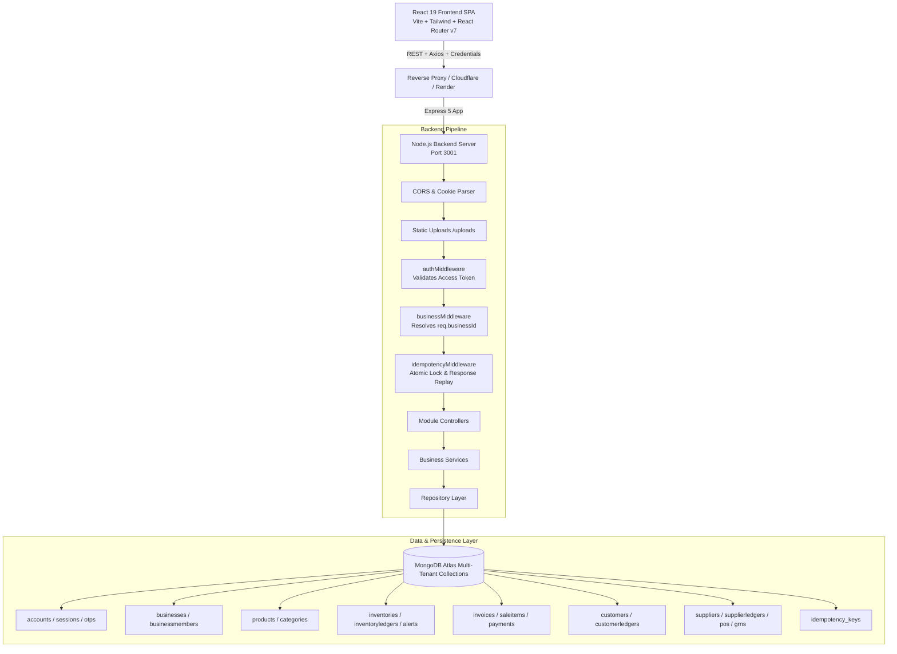
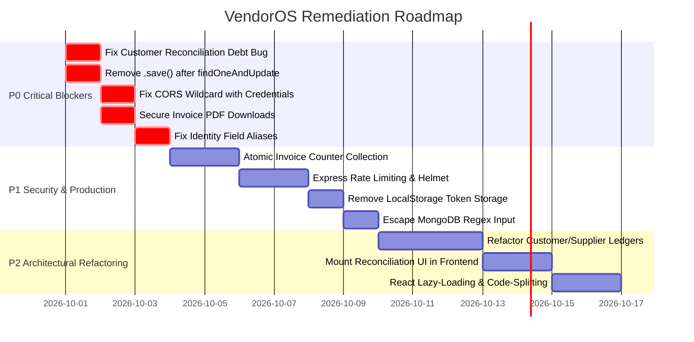

# Enterprise Architecture & Application Security Audit Report
**Project Name:** VendorOS (Retail & Inventory Management Platform)  
**Date:** September 30, 2026  
**Auditor:** Principal Full-Stack Software Architect & Senior AppSec Auditor  
**Scope:** Full-Stack Repository Audit (Frontend, Backend, Database Models, Pipelines, Middleware, Security Configurations)  
**Classification:** Proprietary & Confidential  

---

## Table of Contents
1. [Executive Summary & Architecture Overview](#1-executive-summary--architecture-overview)
2. [Critical Flaws, Logic Errors & Broken Implementations](#2-critical-flaws-logic-errors--broken-implementations)
3. [Security & Production Hardening (AppSec Audit)](#3-security--production-hardening-appsec-audit)
4. [Performance & Code Optimization](#4-performance--code-optimization)
5. [Codebase Health, Technical Debt & Architectural Gaps](#5-codebase-health-technical-debt--architectural-gaps)
6. [Prioritized Action Plan & Remediation Roadmap](#6-prioritized-action-plan--remediation-roadmap)
7. [Appendix: Critical Code Fixes (Before & After Diff Snippets)](#7-appendix-critical-code-fixes-before--after-diff-snippets)

---

## 1. Executive Summary & Architecture Overview

### 1.1 Executive Summary
VendorOS is an end-to-end multi-tenant retail POS, inventory ledger, and supplier procurement platform. Over seven architectural phases, the platform has achieved substantial implementation across:
- **Authentication & Multi-Tenant Onboarding** (JWT-based dual-token flow, phone OTP challenges, tenant isolation middleware `req.businessId`).
- **Product Catalog & Category Hierarchy** (SKU/barcode uniqueness per tenant, cursor-based pagination, soft-delete archival).
- **Double-Entry Inventory Ledger** (Atomic stock movement tracking for IN/OUT/ADJUST/OPENING, reorder thresholds, deterministic alert rules).
- **POS Checkout & Transaction Processing** (Atomic stock deduction, frozen line-item pricing snapshots, PDF invoice generation, gross profit reporting).
- **Customer CRM & Udhaar (Credit) Ledger** (Sub-ledger for customer debt, credit limit enforcement, partial settlements).
- **Supplier Procurement & Accounts Payable** (Supplier 360°, Purchase Orders, Goods Received Notes/GRN, payables tracking).
- **Idempotency Engine & System Reconciliation** (Cryptographic request hashing, cached response replay, cross-entity state drift detection).

However, **critical logic bugs, race conditions, severe AppSec vulnerabilities, and architectural anti-patterns** threaten data integrity, financial accuracy, and tenant security. Most notably:
1. An **inverted variable bug in the Customer Reconciliation engine** that wipes out all customer debt to ₹0 upon running auto-fix.
2. An **anti-concurrency pattern** where Mongoose `.save()` is called on stale documents immediately after atomic `findOneAndUpdate()`, silently wiping out concurrent stock deductions.
3. An **insecure CORS configuration** that reflects any incoming Origin with `credentials: true`.
4. **Publicly accessible, unauthenticated PDF tax invoices** exposed via static file serving.
5. An **unbounded embedded array anti-pattern** in Customer and Supplier ledgers that violates MongoDB document size limits.

### 1.2 Architectural Breakdown



---

## 2. Critical Flaws, Logic Errors & Broken Implementations

### Finding 2.1 — CATASTROPHIC: Customer Reconciliation Engine Wipes Out Customer Debt
- **Severity:** P0 (Critical Financial Blocker)
- **Affected File:** `Backend/src/services/reconciliation.service.js` (Lines 156–175)
- **Root Cause:**
  When checking for ledger discrepancies, `reconcileCustomers` attempts to compute running balance from `ledgerDoc.entries`:
  ```javascript
  for (const entry of ledgerDoc.entries) {
    if (entry.entryType === "SALE_CREDIT" || (entry.debit && entry.debit > 0)) {
      running += Number(entry.unpaidAmount || entry.debit || 0);
    } else if (entry.entryType === "PAYMENT_RECEIVED" || (entry.credit && entry.credit > 0)) {
      running -= Number(entry.paymentAmount || entry.credit || 0);
    }
  }
  ```
  In `customer.model.js` (lines 175–186) and `customerLedger.repository.js`, the schema defines the fields as **`creditAmount`** (the debt incurred) and **`debitAmount`** (the payment received). The properties `unpaidAmount`, `paymentAmount`, `debit`, and `credit` **do not exist** on `customerLedgerEntrySchema`.
  Consequently:
  `Number(entry.unpaidAmount || entry.debit || 0)` evaluates to **`0`**.
  `authoritativeBalance` is calculated as **`0`**.
  If a merchant triggers `reconcileCustomers(businessId, true)` (Auto-Fix enabled), the service executes:
  ```javascript
  await Customer.updateOne(
    { _id: customer._id, businessId: bId },
    { $set: { currentBalance: authoritativeBalance } } // sets currentBalance to 0!
  );
  ```
  This **wipes out all debtor balances across the business**, destroying accounts receivable records.
- **Remediation:**
  Update `reconciliation.service.js` to reference `entry.creditAmount` and `entry.debitAmount`:
  ```javascript
  for (const entry of ledgerDoc.entries) {
    if (entry.entryType === "SALE_CREDIT") {
      running += Number(entry.creditAmount || 0);
    } else if (entry.entryType === "PAYMENT_RECEIVED") {
      running -= Number(entry.debitAmount || 0);
    } else if (entry.entryType === "ADJUSTMENT") {
      running += Number(entry.creditAmount || 0) - Number(entry.debitAmount || 0);
    }
  }
  ```

---

### Finding 2.2 — CRITICAL: Stale Document `.save()` Overwrites Atomic Concurrency Updates
- **Severity:** P0 (Critical Data Loss & Inventory Corruption)
- **Affected Files:**
  - `Backend/src/repositories/sale.repository.js` (Line 306)
  - `Backend/src/repositories/inventory.repository.js` (Lines 324 & 599)
- **Root Cause:**
  To guarantee concurrency safety, the codebase uses `Inventory.findOneAndUpdate()` with an atomic `$gte` condition and `$inc` decrement. However, immediately following the atomic operation, it calls `.save()` on the returned Mongoose document to update `lowStockAlert`:
  ```javascript
  const updatedInv = await Inventory.findOneAndUpdate(
    { _id: update.inventory._id, businessId, availableStock: { $gte: update.quantity } },
    { $inc: { availableStock: -Math.abs(update.quantity) } },
    { new: true, ...sessionOpt }
  );
  // ...
  updatedInv.lowStockAlert = updatedInv.availableStock <= (updatedInv.reorderLevel || 5);
  await updatedInv.save(sessionOpt); // Stale state rewrite!
  ```
  **Race Condition Lifecycle:**
  1. Store has 10 units in stock.
  2. Transaction A executes `findOneAndUpdate({ $inc: -2 })` $\rightarrow$ DB has 8; Transaction A's local document has `availableStock = 8`.
  3. Concurrent Transaction B executes `findOneAndUpdate({ $inc: -3 })` $\rightarrow$ DB has 5; Transaction B's local document has `availableStock = 5`.
  4. Transaction A now executes `await updatedInv.save()`. Because Mongoose `.save()` writes back all modified fields from Transaction A's memory snapshot, it writes `{ availableStock: 8 }` back to the database!
  5. **Result:** Transaction B's deduction of 3 units is completely overwritten. Stock reverts from 5 back to 8, violating atomic invariants.
- **Remediation:**
  Never call `.save()` on a document fetched via `findOneAndUpdate`. Compute `lowStockAlert` atomically in the update pipeline or execute an isolated `$set`:
  ```javascript
  const updatedInv = await Inventory.findOneAndUpdate(
    { _id: update.inventory._id, businessId, availableStock: { $gte: update.quantity } },
    { $inc: { availableStock: -Math.abs(update.quantity) } },
    { new: true, ...sessionOpt }
  );

  const isLowStock = updatedInv.availableStock <= (updatedInv.reorderLevel || 5);
  await Inventory.updateOne(
    { _id: updatedInv._id },
    { $set: { lowStockAlert: isLowStock, updatedAt: new Date() } },
    sessionOpt
  );
  ```

---

### Finding 2.3 — HIGH: Race Condition in Sequential Invoice Generation (`getNextInvoiceNumber`)
- **Severity:** P1 (Concurrency Failure on High-Traffic POS)
- **Affected File:** `Backend/src/repositories/sale.repository.js` (Lines 18–30)
- **Root Cause:**
  Invoice number generation relies on a non-atomic query:
  ```javascript
  const count = await Invoice.countDocuments({ businessId }).session(session);
  let seq = 1001 + count;
  let candidate = `INV-${seq}`;
  while (await Invoice.exists({ businessId, invoiceNumber: candidate }).session(session)) {
    seq++;
    candidate = `INV-${seq}`;
  }
  return candidate;
  ```
  When two POS terminals or cashiers submit orders simultaneously:
  1. Both call `countDocuments({ businessId })` $\rightarrow$ both receive identical count $N$.
  2. Both generate candidate `INV-(1001 + N)`.
  3. `Invoice.exists` returns `false` for both because neither has committed yet.
  4. Both attempt to insert `invoiceNumber: "INV-1005"`.
  5. The compound unique index `invoiceSchema.index({ businessId: 1, invoiceNumber: 1 }, { unique: true })` aborts the second transaction with a `11000 Duplicate Key Error`, crashing the sale checkout.
- **Remediation:**
  Implement a dedicated atomic sequence collection (`counters`) utilizing `findOneAndUpdate` with `$inc`:
  ```javascript
  const getNextInvoiceNumber = async (businessId, session = null) => {
    const counter = await Counter.findOneAndUpdate(
      { businessId, sequenceName: "INVOICE" },
      { $inc: { seq: 1 } },
      { new: true, upsert: true, session }
    );
    return `INV-${counter.seq}`;
  };
  ```

---

### Finding 2.4 — HIGH: Identity Property Mismatch Disconnects Audit Trails (`req.user.id` vs `req.user.accountId`)
- **Severity:** P1 (Silent Audit Failure & Security Misattribution)
- **Affected Files:**
  - `Backend/src/controllers/customer.controller.js` (Lines 236, 262)
  - `Backend/src/controllers/supplier.controller.js` (Lines 215, 246, 289)
  - `Backend/src/controllers/purchaseOrder.controller.js` (Line 11)
  - `Backend/src/controllers/reconciliation.controller.js` (Lines 15, 56)
  - `Backend/src/middlewares/idempotency.middleware.js` (Line 52)
- **Root Cause:**
  `auth.middleware.js` (Lines 55–63) sets the request identity object as:
  ```javascript
  req.user = {
    accountId: account._id.toString(),
    email: account.email,
    phone: account.phone,
    status: account.status,
  };
  req.account = account;
  ```
  Notice that `req.user.id`, `req.user._id`, and `req.user.fullName` are **not set**.
  However, in `customer.controller.js`:
  ```javascript
  const user = { id: req.user?.id, fullName: req.user?.fullName };
  ```
  And in `supplier.controller.js`:
  ```javascript
  const accountId = req.user?.id || req.user?._id || null;
  ```
  Both `id` and `fullName` evaluate to `undefined` or `null`. As a result:
  - Ledger entries for customer payments, supplier settlements, and manual adjustments have `createdBy: null` and `createdByName: ""`.
  - Idempotency middleware evaluates `const userId = req.user?.id || req.user?._id || null;` to `null`, collapsing user-scoped idempotency keys to tenant-wide locks.
- **Remediation:**
  Standardize `auth.middleware.js` to expose consistent aliases:
  ```javascript
  req.user = {
    id: account._id.toString(),
    accountId: account._id.toString(),
    fullName: account.fullName,
    email: account.email,
    phone: account.phone,
    status: account.status,
  };
  ```

---

### Finding 2.5 — MEDIUM: Missing Frontend Route & Navigation for Reconciliation Engine
- **Severity:** P2 (Orphaned Backend Capability)
- **Affected Files:**
  - `Frontend/src/App.jsx`
  - `Frontend/src/components/layout/Sidebar.jsx`
- **Root Cause:**
  The backend implements comprehensive cross-system reconciliation routes (`/api/reconciliation/run`, `/api/reconciliation/inventory`, `/api/reconciliation/customers`, `/api/reconciliation/suppliers`). However:
  1. `Frontend/src/App.jsx` registers no `/reconciliation` route.
  2. `Frontend/src/components/layout/Sidebar.jsx` includes no menu item or link for system audits.
  Merchants and store owners cannot access or monitor the reconciliation health score, discrepancy tables, or auto-fix features from the user interface.
- **Remediation:**
  Create `Frontend/src/features/reconciliation/ReconciliationPage.jsx`, mount it under `/reconciliation` in `App.jsx`, and add an "Integrity & Audits" item with icon `ShieldCheck` to `Sidebar.jsx`.

---

## 3. Security & Production Hardening (AppSec Audit)

### Evaluation Against OWASP Top 10 (2021/2025)

| OWASP Category | Finding | Current State | Risk Level |
| :--- | :--- | :--- | :--- |
| **A01: Broken Access Control** | Unauthenticated Static Invoice Access | Static `/uploads` exposes all PDF invoices publicly | **CRITICAL** |
| **A01: Broken Access Control** | Wildcard Origin with Credentials | CORS reflects all origins with `credentials: true` | **CRITICAL** |
| **A02: Cryptographic Failures** | Weak & Hardcoded JWT Secrets | Default dictionary secrets in `.env` | **HIGH** |
| **A03: Injection** | MongoDB Query Regex Injection | Unescaped search strings in `$regex` queries | **MEDIUM** |
| **A04: Insecure Design** | Missing API Rate Limiting | No rate limiting on auth, OTP, or checkout | **HIGH** |
| **A05: Security Misconfiguration** | Missing HTTP Security Headers | No `helmet`, no HSTS, no CSP, no X-Frame-Options | **HIGH** |
| **A07: Identification & Auth Failures** | Dual Token Storage / LocalStorage | JWTs stored in `localStorage` alongside cookies | **HIGH** |

---

### Finding 3.1 — CRITICAL: Insecure Dynamic CORS with Credentials (Arbitrary Origin Reflection)
- **Vulnerability:** OWASP A01 (Broken Access Control) / CWE-942
- **Affected File:** `Backend/src/app.js` (Lines 26–46)
- **Vulnerability Details:**
  ```javascript
  app.use(
    cors({
      origin: (origin, callback) => {
        return callback(null, true); // Dynamically approves ANY incoming origin!
      },
      credentials: true,
      methods: ["GET", "POST", "PUT", "PATCH", "DELETE", "OPTIONS"],
      // ...
    })
  );
  ```
  When `credentials: true` is combined with a dynamic origin reflection function (`callback(null, true)`), the browser receives:
  `Access-Control-Allow-Origin: https://attacker.com`  
  `Access-Control-Allow-Credentials: true`
  **Impact:** An attacker who entices an authenticated VendorOS user to visit a malicious website can issue authenticated cross-origin fetch requests using the user's cookies, exfiltrating financial customer data, supplier records, and inventory ledgers.
- **Remediation:**
  Restrict CORS origins to an explicit whitelist driven by environment variables:
  ```javascript
  const allowedOrigins = process.env.ALLOWED_ORIGINS
    ? process.env.ALLOWED_ORIGINS.split(",").map((o) => o.trim())
    : ["http://localhost:5173", "http://localhost:3000"];

  app.use(
    cors({
      origin: (origin, callback) => {
        if (!origin || allowedOrigins.includes(origin)) {
          return callback(null, true);
        }
        return callback(new Error("CORS policy violation: Origin not allowed"), false);
      },
      credentials: true,
      methods: ["GET", "POST", "PUT", "PATCH", "DELETE", "OPTIONS"],
      allowedHeaders: ["Content-Type", "Authorization", "x-business-id", "Idempotency-Key"],
      exposedHeaders: ["Idempotency-Key", "X-Cache"],
    })
  );
  ```

---

### Finding 3.2 — CRITICAL: Unauthenticated Public Static Access to Tax Invoices
- **Vulnerability:** OWASP A01 (Broken Access Control) / BOLA / Excessive Data Exposure
- **Affected Files:**
  - `Backend/src/app.js` (Line 52)
  - `Backend/src/services/invoicePdf.service.js` (Lines 14, 258–265)
- **Vulnerability Details:**
  `app.use("/uploads", express.static(path.join(__dirname, "../uploads")));`
  Generated PDF files are saved to `uploads/invoices/invoice-${invoiceNumber}.pdf`.
  Because invoice numbers follow predictable sequential values (`INV-1001`, `INV-1002`, `INV-1003`), **any unauthenticated party on the internet** can scrape tax invoices by sending:
  `GET https://api.vendoros.com/uploads/invoices/invoice-INV-1001.pdf`
  **Data Exposed:** Customer names, phone numbers, complete purchase histories, item prices, store names, merchant addresses, GSTIN numbers, and payment modes.
- **Remediation:**
  Remove public static serving for `/uploads/invoices`. Serve invoice PDFs **exclusively** through authenticated, business-scoped controller endpoints (`GET /api/sales/:id/download-pdf` or `GET /api/sales/:id/preview-pdf`) that verify tenant membership via `authMiddleware` and `businessMiddleware`.

---

### Finding 3.3 — HIGH: Token Storage in LocalStorage Exposes Sessions to XSS
- **Vulnerability:** OWASP A07 (Identification and Authentication Failures)
- **Affected Files:**
  - `Frontend/src/services/api.js` (Lines 17–25, 76–84)
  - `Frontend/src/context/AuthContext.jsx`
- **Vulnerability Details:**
  The backend sends auth cookies (`accessToken` and `refreshToken` with `httpOnly: true`), but also returns the tokens in the response JSON payload. The frontend Axios interceptor then copies both tokens into browser `localStorage`:
  ```javascript
  localStorage.setItem("accessToken", accessToken);
  localStorage.setItem("refreshToken", newRefreshToken);
  ```
  `localStorage` is accessible to any JavaScript running on the page. In the event of an XSS vulnerability in any npm package or third-party script, an attacker can read the `refreshToken` and maintain permanent access to the user's account.
- **Remediation:**
  Rely strictly on `httpOnly`, `SameSite=Lax` (or `Strict`), `Secure` cookies. Remove `localStorage.setItem("accessToken")` and `localStorage.setItem("refreshToken")` from the frontend interceptor.

---

### Finding 3.4 — HIGH: Missing Rate Limiting on Authentication & Mutations
- **Vulnerability:** OWASP A04 (Insecure Design) / Brute-Force & Denial of Service
- **Affected Endpoints:**
  - `POST /api/auth/login`
  - `POST /api/auth/register`
  - `POST /api/auth/verify-phone`
  - `POST /api/auth/resend-phone-otp`
  - `POST /api/sales`
- **Vulnerability Details:**
  The backend has no rate-limiting middleware (`express-rate-limit`).
  - An attacker can execute automated credential-stuffing against `/api/auth/login`.
  - An attacker can flood the SMS gateway / OTP service via `/api/auth/resend-phone-otp`, causing financial billing depletion.
  - A script can spam `/api/sales` to exhaust inventory locks or flood database connections.
- **Remediation:**
  Install `express-rate-limit` and configure dedicated limiters:
  ```javascript
  const rateLimit = require("express-rate-limit");

  const authLimiter = rateLimit({
    windowMs: 15 * 60 * 1000, // 15 minutes
    max: 10, // 10 attempts
    message: { success: false, code: "TOO_MANY_REQUESTS", message: "Too many login attempts. Please try again later." },
    standardHeaders: true,
    legacyHeaders: false,
  });

  const otpLimiter = rateLimit({
    windowMs: 60 * 60 * 1000,
    max: 5,
    message: { success: false, code: "OTP_RATE_LIMIT", message: "Exceeded OTP request limit. Try again in an hour." },
  });
  ```

---

### Finding 3.5 — HIGH: Missing HTTP Security Headers (No Helmet Integration)
- **Vulnerability:** OWASP A05 (Security Misconfiguration)
- **Affected File:** `Backend/src/app.js`
- **Vulnerability Details:**
  The Express app does not utilize `helmet`. The API responses omit:
  - `Strict-Transport-Security` (HSTS)
  - `X-Content-Type-Options: nosniff`
  - `X-Frame-Options: DENY` (permitting clickjacking)
  - `Content-Security-Policy` (CSP)
  - `Referrer-Policy: no-referrer-when-downgrade`
- **Remediation:**
  Add `helmet` to `Backend/package.json` and register `app.use(helmet())` at the top of `Backend/src/app.js`.

---

### Finding 3.6 — MEDIUM: Regex Injection in Multi-Tenant Search Queries
- **Vulnerability:** OWASP A03 (Injection) / ReDoS
- **Affected Files:**
  - `Backend/src/repositories/sale.repository.js` (Line 450)
  - `Backend/src/repositories/inventory.repository.js` (Lines 61, 441)
  - `Backend/src/repositories/customer.repository.js`
- **Vulnerability Details:**
  User-supplied query parameters are passed directly to `new RegExp(term, "i")` without escaping special regex characters:
  ```javascript
  const term = filters.search.trim();
  query.$or = [
    { invoiceNumber: { $regex: term, $options: "i" } },
    { customerName: { $regex: term, $options: "i" } },
  ];
  ```
  If an attacker submits complex nested quantifiers like `((a+)+)+$`, the MongoDB regex engine can experience exponential backtracking (Regular Expression Denial of Service - ReDoS), pinning database CPU to 100%.
- **Remediation:**
  Escape user regex input before constructing MongoDB query expressions:
  ```javascript
  const escapeRegex = (str) => str.replace(/[.*+?^${}()|[\]\\]/g, "\\$&");
  const cleanTerm = escapeRegex(term);
  ```

---

## 4. Performance & Code Optimization

### 4.1 Backend Performance

#### 1. Unbounded Array Anti-Pattern in `CustomerLedger` and `SupplierLedger`
- **Issue:** Both `CustomerLedger` and `SupplierLedger` schemas embed transactions as subdocuments in an unbounded array `entries: [customerLedgerEntrySchema]`.
- **Impact:**
  - Over months of active trade, a customer or supplier ledger accumulates thousands of transactions.
  - In MongoDB, documents have a hard **16MB limit**. Once exceeded, further transactions fail with `BSONObjectTooLarge`.
  - Every update pushes a new entry and calls `await ledgerDoc.save()`, rewriting the entire multi-megabyte document to disk.
  - In-memory pagination (`allEntries.slice(skip, skip + limit)`) forces the server to transfer and deserialize the full historical array on every statement view.
- **Architectural Fix:**
  Refactor `CustomerLedgerEntry` and `SupplierLedgerEntry` into dedicated collections (identical to how `InventoryLedger` is structured). Use compound indexes `{ businessId: 1, customerId: 1, createdAt: -1 }` with native cursor/skip-limit pagination.

#### 2. N+1 Queries in Store State Retrieval
- **Issue:** `inventory.repository.js` (`findInventoryStoreState`, lines 78–90) fetches all products via `Product.find()`, then executes `Inventory.find({ productId: { $in: productIds } })`, and then performs an in-memory merge.
- **Optimization:** Use a MongoDB `$lookup` aggregation pipeline with projected fields to join inventory balances in a single database round-trip.

---

### 4.2 Frontend Performance

#### 1. Missing Code-Splitting & Lazy Loading in Router
- **Issue:** `Frontend/src/App.jsx` statically imports all feature views:
  ```javascript
  import POSTerminalPage from "./features/pos/POSTerminalPage";
  import InventoryAuditPage from "./features/inventory/InventoryAuditPage";
  import SuppliersPage from "./features/suppliers/SuppliersPage";
  import CustomersPage from "./features/customers/CustomersPage";
  ```
  The initial bundle loaded by a cashier or manager includes all supplier 360 modals, PDF viewers, audit tables, and onboarding flows.
- **Optimization:** Wrap all route components with `React.lazy()` and `Suspense`:
  ```javascript
  const POSTerminalPage = React.lazy(() => import("./features/pos/POSTerminalPage"));
  const InventoryAuditPage = React.lazy(() => import("./features/inventory/InventoryAuditPage"));
  ```

#### 2. 123 Linter Warnings (Synchronous `setState` in Effects)
- **Issue:** Running `oxlint` reveals 123 warnings across 106 frontend files. Many components call `setLoading(true)` or fetch triggers synchronously inside `useEffect` bodies without cleanup or dependency completeness, risking cascading re-renders and React 19 Compiler bailouts.

---

## 5. Codebase Health, Technical Debt & Architectural Gaps

### 5.1 Validation Schema Inconsistencies
The codebase exhibits three conflicting validation paradigms:
1. **Middleware-Level Validation (Best Practice):** `sale.routes.js`, `business.routes.js`, `product.routes.js`, and `inventory.routes.js` use `validate(schema)` middleware.
2. **Controller-Level Validation with Ad-hoc Error Catching:** `customer.controller.js` manually invokes `createCustomerSchema.parse(req.body)` inside a `try/catch` and returns a manual 400 format.
3. **Service-Level Validation:** `supplier.service.js` calls `safeParse()` inside the service method and throws an `Error` object with `statusCode = 400`.

**Remediation:** Enforce `validate(schema)` middleware consistently on all route definitions. Remove schema validation logic from controllers and services.

### 5.2 API Response Shape Discrepancies
- Some endpoints return `{ success: true, data: { ... } }`.
- Others return `{ success: true, message: "...", data: { ... } }`.
- Others return pagination metadata inside `data`, while some return a top-level `pagination` object (`{ success: true, data: [...], pagination: { ... } }`).
- Customer sub-ledger returns `{ customer, summary, entries, pagination }`.

**Remediation:** Introduce a standardized API response utility:
```javascript
res.success = (data, message = null, meta = {}) => {
  return res.status(200).json({ success: true, message, data, ...meta });
};
```

### 5.3 Route Redundancies in `app.js`
In `Backend/src/app.js`:
- `/api/business` AND `/api/businesses` are both mounted to `businessRoutes`.
- `/api/sales` AND `/api/invoices` are both mounted to `saleRoutes`.
- `/api/purchase-orders` AND `/api/purchases/orders` are both mounted to `purchaseOrderRoutes`.
- `/api/purchases` AND `/api/grn` are both mounted to `purchaseRoutes`.

While aliases provide temporary backwards compatibility, multiple route mountings without deprecation headers cause confusion and complicate API documentation and auditing.

---

## 6. Prioritized Action Plan & Remediation Roadmap



### Priority Classification Matrix

#### P0 — Critical Blockers (Immediate Action Required)
1. **Fix Reconciliation Engine Debt Calculation:** Update `reconciliation.service.js` to reference `creditAmount` and `debitAmount` so auto-fix does not zero out customer balances.
2. **Eliminate Stale `.save()` on Inventory Decrements:** Replace `.save()` after `findOneAndUpdate()` with atomic `$set` updates in `sale.repository.js` and `inventory.repository.js`.
3. **Remediate Wildcard CORS:** Restrict allowed origins to an explicit whitelist in `app.js`.
4. **Lock Down PDF Invoices:** Remove static `/uploads` route for invoices; enforce tenant verification on downloads.
5. **Normalize `req.user` in Auth Middleware:** Ensure `req.user.id`, `req.user.accountId`, and `req.user.fullName` are populated.

#### P1 — Security & Data Integrity (Deploy within 7 Days)
1. **Implement Atomic Invoice Counter:** Replace `countDocuments` loop with atomic counter model.
2. **Apply Security Headers & Rate Limiting:** Integrate `helmet` and `express-rate-limit` across all public and mutation endpoints.
3. **Transition to Pure HttpOnly Cookies:** Eliminate `localStorage` token mirroring in Frontend Axios interceptors.
4. **Sanitize Search Regex Inputs:** Add regex escaping utility to prevent ReDoS on product, customer, and supplier search.

#### P2 — Optimization & Architectural Health (Deploy within 14 Days)
1. **Migrate Sub-Ledgers to Standalone Collections:** Break `CustomerLedger.entries` and `SupplierLedger.entries` into discrete collections to avoid MongoDB 16MB limits.
2. **Expose Reconciliation UI:** Add Reconciliation view and sidebar entry in the Frontend.
3. **Implement Route Code-Splitting:** Add `React.lazy()` boundaries in `App.jsx`.
4. **Standardize Validation Layer:** Migrate all route validation to the `validate` middleware.

#### P3 — Polish & Technical Debt (Deploy within 30 Days)
1. **Standardize API Response Envelope:** Implement unified response format across all controllers.
2. **Resolve 123 Frontend Lint Warnings:** Address synchronous effect states and missing hook dependencies.
3. **Deprecate Route Aliases:** Consolidate duplicate route mounts in `app.js`.

---

## 7. Appendix: Critical Code Fixes (Before & After Diff Snippets)

### Diff 1: Customer Reconciliation Variable Bug Fix
**File:** `Backend/src/services/reconciliation.service.js`
```diff
--- a/Backend/src/services/reconciliation.service.js
+++ b/Backend/src/services/reconciliation.service.js
@@ -155,14 +155,14 @@ class ReconciliationService {
         let running = 0;
         for (const entry of ledgerDoc.entries) {
-          if (entry.entryType === "SALE_CREDIT" || (entry.debit && entry.debit > 0)) {
-            running += Number(entry.unpaidAmount || entry.debit || 0);
-          } else if (entry.entryType === "PAYMENT_RECEIVED" || (entry.credit && entry.credit > 0)) {
-            running -= Number(entry.paymentAmount || entry.credit || 0);
+          if (entry.entryType === "SALE_CREDIT") {
+            running += Number(entry.creditAmount || 0);
+          } else if (entry.entryType === "PAYMENT_RECEIVED") {
+            running -= Number(entry.debitAmount || 0);
           } else if (entry.entryType === "DEBT_INCREASE") {
-            running += Number(entry.debit || 0);
+            running += Number(entry.creditAmount || 0);
           } else if (entry.entryType === "DEBT_DECREASE") {
-            running -= Number(entry.credit || 0);
+            running -= Number(entry.debitAmount || 0);
           }
         }
         authoritativeBalance = Math.max(0, Math.round(running * 100) / 100);
```

---

### Diff 2: Stale Document Save Removal (Atomic Inventory Preservation)
**File:** `Backend/src/repositories/sale.repository.js`
```diff
--- a/Backend/src/repositories/sale.repository.js
+++ b/Backend/src/repositories/sale.repository.js
@@ -303,8 +303,11 @@ const createSale = async (businessId, saleData, session = null) => {
         throw error;
       }
 
-      // Re-evaluate low stock status
-      updatedInv.lowStockAlert = updatedInv.availableStock <= (updatedInv.reorderLevel || 5);
-      await updatedInv.save(sessionOpt);
+      // Concurrency-Safe: Update lowStockAlert via selective updateOne without writing back stale state
+      const isLow = updatedInv.availableStock <= (updatedInv.reorderLevel || 5);
+      await Inventory.updateOne(
+        { _id: updatedInv._id },
+        { $set: { lowStockAlert: isLow, updatedAt: new Date() } },
+        sessionOpt
+      );
 
       // Record immutable ledger entry with exact atomically verified balanceAfter
```

---

### Diff 3: CORS Hardening (Whitelist Enforcement)
**File:** `Backend/src/app.js`
```diff
--- a/Backend/src/app.js
+++ b/Backend/src/app.js
@@ -25,9 +25,18 @@ app.set("trust proxy", 1);
 // Robust CORS for production and cross-domain credentials
+const allowedOrigins = process.env.ALLOWED_ORIGINS
+  ? process.env.ALLOWED_ORIGINS.split(",").map((o) => o.trim())
+  : ["http://localhost:5173", "http://localhost:3000", "http://localhost:3001"];
+
 app.use(
   cors({
     origin: (origin, callback) => {
-      return callback(null, true);
+      if (!origin || allowedOrigins.includes(origin)) {
+        return callback(null, true);
+      }
+      return callback(new Error("CORS origin not allowed by policy"), false);
     },
     credentials: true,
     methods: ["GET", "POST", "PUT", "PATCH", "DELETE", "OPTIONS"],
```

---

### Diff 4: User Context Normalization
**File:** `Backend/src/middlewares/auth.middleware.js`
```diff
--- a/Backend/src/middlewares/auth.middleware.js
+++ b/Backend/src/middlewares/auth.middleware.js
@@ -53,7 +53,10 @@ const authMiddleware = async (req, res, next) => {
     }
 
     req.user = {
+      id: account._id.toString(),
+      _id: account._id,
       accountId: account._id.toString(),
+      fullName: account.fullName,
       email: account.email,
       phone: account.phone,
       status: account.status,
```

---

**Report Concluded.**  
*This document should be treated as the authoritative baseline for all pending refactoring, security remediation sprints, and architectural enhancements.*
